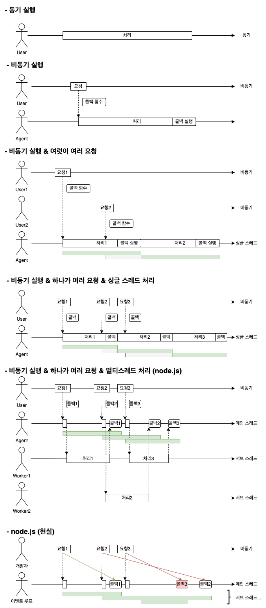

# node.js 비동기 학습

## 1) 비동기 다이어그램

### 결론

- 동기 함수: 직접 처리
- 비동기 함수: 처리를 요청, 마무리는 콜백 함수로!

## 2) 실습 코드

### 0. [sync](./sync.js)

### 1. [longSync](./longSync.js)

### 2. [async](./async.js)

### 3. [asyncStrange](./asyncStrange.js)

### 4. [asyncWithLongSync](./asyncWithLongSync.js)

### 5. [asyncInOrder1](./asyncInOrder1.js)

### 6. [asyncInOrder1WithLongSync](./asyncInOrder1WithLongSync.js)

### 7. [asyncInOrder2](./asyncInOrder2.js)

### 8. [asyncInOrder2WithLongSync](./asyncInOrder2WithLongSync.js)

### 9. [callbackHell](./callbackHell.js)

### 10. [promise](./promise.js)

### 11. [promiseAsyncAwait](./promiseAsyncAwait.js)
